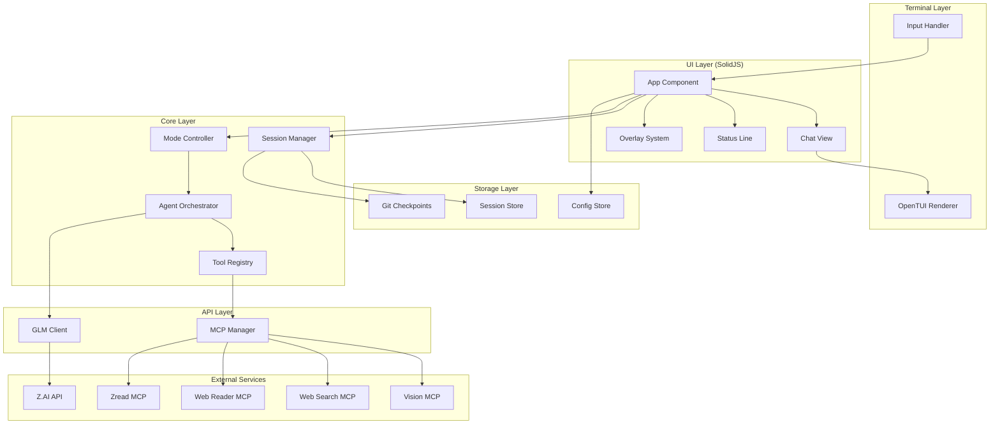
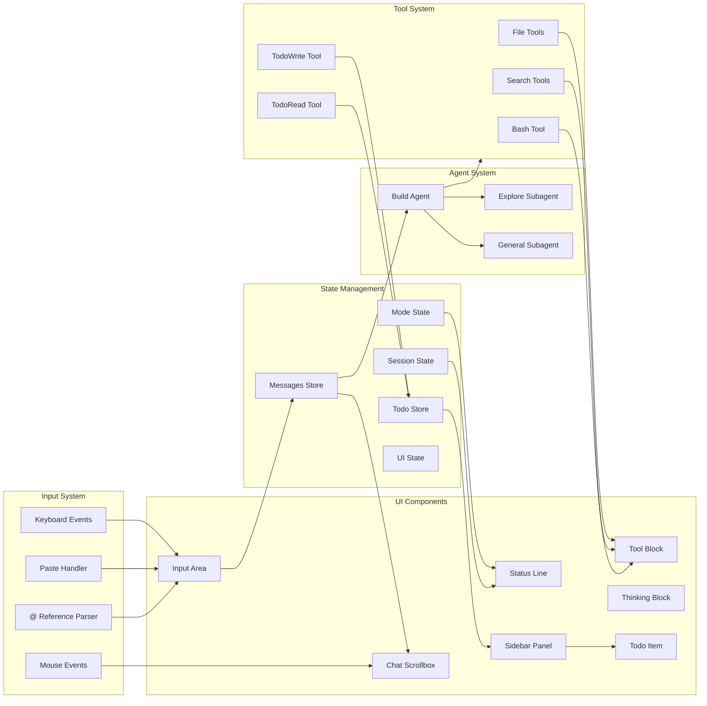

# Design

> Architecture and system design for glm-cli

Generated: 01-19-2026

---

## 1. System Overview

glm-cli is a terminal-based AI coding agent with a brutalist, flicker-free UI. It connects to Zhipu AI's GLM models via the Coding Plan API and integrates with 4 MCP servers for extended capabilities.

### Design Goals

1. **Flicker-Free** - 16ms event batching, 60fps streaming
2. **Brutalist** - No emojis, minimal decoration, function over form
3. **Responsive** - Sub-50ms input latency
4. **Resilient** - Auto-retry, auto-save, graceful degradation

---

## 2. System Architecture



---

## 3. Component Architecture



---

## 4. Directory Structure

```
glm-cli/
├── src/
│   ├── index.ts                 # CLI entry point
│   ├── global.ts                # Global paths configuration
│   │
│   ├── bus/
│   │   ├── index.ts             # Re-exports
│   │   ├── bus.ts               # Event bus singleton
│   │   └── events.ts            # Event definitions
│   │
│   ├── storage/
│   │   ├── index.ts             # Re-exports
│   │   └── storage.ts           # File-based storage
│   │
│   ├── agent/
│   │   ├── build.ts             # Primary build agent
│   │   ├── explore.ts           # Explore subagent (read-only)
│   │   ├── general.ts           # General subagent
│   │   └── orchestrator.ts      # Agent coordination
│   │
│   ├── api/
│   │   ├── client.ts            # GLM API client
│   │   ├── stream.ts            # Streaming handler
│   │   └── types.ts             # API types
│   │
│   ├── mcp/
│   │   ├── manager.ts           # MCP connection manager
│   │   ├── vision.ts            # Vision MCP (stdio)
│   │   ├── web-search.ts        # Web Search MCP (HTTP)
│   │   ├── web-reader.ts        # Web Reader MCP (HTTP)
│   │   └── zread.ts             # Zread MCP (HTTP)
│   │
│   ├── session/
│   │   ├── manager.ts           # Session lifecycle
│   │   ├── checkpoint.ts        # Git checkpoints
│   │   ├── compact.ts           # Auto-compaction
│   │   ├── store.ts             # Session persistence
│   │   └── todo.ts              # Todo data model and operations
│   │
│   ├── tools/
│   │   ├── registry.ts          # Tool registration
│   │   ├── file-read.ts         # File read tool
│   │   ├── file-write.ts        # File write tool
│   │   ├── file-edit.ts         # File edit tool
│   │   ├── glob.ts              # Glob tool
│   │   ├── grep.ts              # Grep tool
│   │   ├── bash.ts              # Bash tool
│   │   ├── todo-write.ts        # TodoWrite tool
│   │   └── todo-read.ts         # TodoRead tool
│   │
│   ├── ui/
│   │   ├── App.tsx              # Root component
│   │   ├── components/
│   │   │   ├── ChatView.tsx     # Message list
│   │   │   ├── InputArea.tsx    # User input
│   │   │   ├── StatusLine.tsx   # Bottom status
│   │   │   ├── Sidebar.tsx      # Right sidebar panel
│   │   │   ├── TodoItem.tsx     # Individual todo display
│   │   │   ├── ToolBlock.tsx    # Collapsible tool result
│   │   │   ├── ThinkingBlock.tsx # Collapsible thinking
│   │   │   ├── MessageBlock.tsx # Single message
│   │   │   └── Overlay.tsx      # Modal overlays
│   │   │
│   │   └── context/
│   │       ├── session.tsx      # Session context
│   │       ├── mode.tsx         # Mode context
│   │       ├── todo.tsx         # Todo state context
│   │       └── ui.tsx           # UI state context
│   │
│   ├── input/
│   │   ├── handler.ts           # Input event handler
│   │   ├── paste.ts             # Multi-line paste detection
│   │   ├── at-refs.ts           # @ file reference parser
│   │   └── shortcuts.ts         # Keyboard shortcuts
│   │
│   ├── commands/
│   │   ├── registry.ts          # Command registration
│   │   ├── new.ts               # /new command
│   │   ├── save.ts              # /save command
│   │   ├── load.ts              # /load command
│   │   ├── compact.ts           # /compact command
│   │   ├── undo.ts              # /undo command
│   │   ├── redo.ts              # /redo command
│   │   ├── model.ts             # /model command
│   │   ├── mode.ts              # /mode command
│   │   ├── think.ts             # /think command
│   │   ├── instruct.ts          # /instruct command
│   │   ├── config.ts            # /config command
│   │   ├── stats.ts             # /stats command
│   │   ├── help.ts              # /help command
│   │   └── quit.ts              # /quit, /exit commands
│   │
│   ├── modes/
│   │   ├── auto.ts              # AUTO mode logic
│   │   ├── agent.ts             # AGENT mode logic
│   │   ├── planner.ts           # PLANNER mode logic
│   │   ├── plan-prd.ts          # PLAN-PRD mode logic
│   │   └── debug.ts             # DEBUG mode logic
│   │
│   └── util/
│       ├── config.ts            # Configuration loader
│       ├── instructions.ts      # Instruction file discovery
│       ├── git.ts               # Git utilities
│       ├── batch.ts             # 16ms event batching
│       ├── lock.ts              # File locking utility
│       └── logger.ts            # Logging utility
│
├── .opencode/skills/            # AI assistance skills
├── docs/                        # Project documentation
├── AGENTS.md                    # Project brain
├── PRINCIPLES.md                # Non-negotiable rules
├── README.md                    # Project overview
├── package.json
├── tsconfig.json
└── bunfig.toml
```

---

## 5. Data Flow

### 5.1 User Input Flow

1. Keyboard event captured by OpenTUI
2. Input handler processes event
3. If `/command`, route to command registry
4. If `@reference`, trigger autocomplete
5. On Enter, add message to Messages store
6. Mode controller selects appropriate agent
7. Agent processes with tools
8. Streaming response batched at 16ms
9. UI re-renders via SolidJS reconciliation

### 5.2 Streaming Response Flow

1. GLM API returns SSE stream
2. Stream handler parses chunks
3. Thinking content extracted to separate buffer
4. Text content buffered for 16ms
5. `batch()` coalesces state updates
6. `reconcile()` applies minimal DOM changes
7. Scrollbox auto-scrolls to bottom

### 5.3 Tool Execution Flow

1. Agent requests tool execution
2. Tool registry validates parameters (Zod)
3. Tool executes with timeout
4. Result returned to agent
5. ToolBlock component renders result
6. Block starts collapsed, expandable

### 5.4 Session Checkpoint Flow

1. Assistant message completes
2. File changes detected
3. Git stash created with message ID
4. Checkpoint reference stored in session
5. /undo pops stash, /redo re-applies

### 5.5 Todo Update Flow

1. Agent calls TodoWrite tool with updated todo list
2. Tool validates todos via Zod schema
3. Todo.update() writes to storage: `["todo", sessionID]`
4. Bus publishes `todo.updated` event
5. UI context receives event, updates TodoState store
6. Sidebar re-renders with new todos via SolidJS reconciliation
7. Tool returns count of non-completed todos

---

## 6. Key Design Decisions

### 6.1 OpenTUI + SolidJS

**Why:** Flicker-free rendering is non-negotiable. OpenTUI's Zig-powered renderer with SolidJS fine-grained reactivity eliminates the re-render storms common with React-based TUI solutions.

**Trade-off:** Smaller ecosystem than Ink, but performance gains are substantial.

### 6.2 Single API Endpoint

**Why:** The Coding Plan endpoint (`https://api.z.ai/api/coding/paas/v4/`) enables thinking mode by default. Falling back to standard endpoints would lose this capability.

**Trade-off:** No graceful API fallback, but explicit failure is better than silent degradation.

### 6.3 Git-Based Undo/Redo

**Why:** Git stash provides atomic, reliable file state snapshots. Per-message checkpoints enable granular undo.

**Trade-off:** Requires git repository, but most coding projects already have this.

### 6.4 Agent-Controlled Delegation

**Why:** Simpler UX than exposing @ syntax for subagents. The primary agent decides when to delegate based on task complexity.

**Trade-off:** Less user control, but more coherent agent behavior.

### 6.5 16ms Event Batching

**Why:** 60fps target requires updates no faster than 16ms. Batching prevents render thrashing during high-frequency streaming.

**Trade-off:** Slight latency increase (imperceptible), major stability gain.

---

## 7. State Management

### 7.1 Global State (SolidJS Stores)

```typescript
// Session store
interface SessionState {
  id: string
  messages: Message[]
  mode: Mode
  model: Model
  thinking: boolean
  stats: SessionStats
}

// Todo store (per session)
interface Todo {
  id: string        // Unique identifier (e.g., "1", "2", "task-abc")
  content: string   // Brief description of the task
  status: "pending" | "in_progress" | "completed" | "cancelled"
  priority: "high" | "medium" | "low"
}

interface TodoState {
  [sessionID: string]: Todo[]
}

// UI store
interface UIState {
  overlay: Overlay | null
  inputValue: string
  selectedTool: number | null
  scrollPosition: number
  sidebarExpanded: {
    todo: boolean
    mcp: boolean
    diff: boolean
  }
}
```

### 7.2 Context Providers

- `SessionProvider` - Session lifecycle, auto-save
- `ModeProvider` - Mode switching, mode-specific tools
- `TodoProvider` - Todo state, event subscription
- `UIProvider` - Overlay state, input focus

### 7.3 Event Bus

```typescript
// Todo events
namespace TodoEvents {
  const Updated = BusEvent.define("todo.updated", z.object({
    sessionID: z.string(),
    todos: z.array(TodoSchema),
  }))
}

// Event flow: Tool -> Storage -> Bus -> UI
```

---

## 8. Todo System Design

### 8.1 Data Model

```typescript
// src/session/todo.ts
const TodoSchema = z.object({
  id: z.string().describe("Unique identifier for the todo item"),
  content: z.string().describe("Brief description of the task"),
  status: z.enum(["pending", "in_progress", "completed", "cancelled"])
    .describe("Current status of the task"),
  priority: z.enum(["high", "medium", "low"])
    .describe("Priority level of the task"),
})

type Todo = z.infer<typeof TodoSchema>
```

### 8.2 Storage

Todos are stored per-session in the storage layer:
- Key: `["todo", sessionID]`
- Format: JSON array of Todo objects
- Location: `~/.config/glm-cli/storage/todo/{sessionID}.json`

### 8.3 Tools

**TodoWrite** - Replaces the entire todo list
- Parameters: `{ todos: Todo[] }`
- Returns: Count of non-completed todos
- Behavior: Full replacement (not incremental)

**TodoRead** - Returns current todo list
- Parameters: None
- Returns: Current todos array
- Use: Agent checks status before/after tasks

### 8.4 UI Display (Sidebar)

```
Todo
[ ] Set up project structure
[>] Implement API client        <- in_progress (highlighted)
[ ] Add error handling
[x] Write configuration loader  <- completed (muted)
```

**Brutalist Design Rules:**
- No emojis - use ASCII: `[ ]`, `[>]`, `[x]`
- Status colors: pending=muted, in_progress=cyan, completed=muted
- Collapsible when >2 items
- Hidden when all completed
- Click to expand/collapse section

### 8.5 Agent Guidelines

The agent should use TodoWrite proactively when:
1. Task requires 3+ distinct steps
2. User provides a list of tasks
3. Complex, non-trivial work

The agent should NOT use todos when:
1. Single trivial task
2. Purely informational request
3. Task completes in <3 steps

**State Management Rules:**
- Only ONE todo `in_progress` at a time
- Mark complete IMMEDIATELY after finishing
- Cancel irrelevant tasks rather than leaving pending

---

## 9. Error Handling Strategy

| Error Type | Handling |
|------------|----------|
| API timeout | 5 retries with exponential backoff |
| API auth failure | Prompt for new API key |
| MCP connection failure | Disable affected tools, notify user |
| Tool execution error | Display error in tool block, continue |
| Git operation failure | Warn user, disable undo/redo |
| Parse error | Log details, show user-friendly message |
| Todo storage failure | Log error, continue without persistence |

---

## 10. Security Considerations

1. **API Key** - Stored in environment variable or `~/.config/glm-cli/config.json`
2. **File Access** - Tools operate within working directory by default
3. **Command Execution** - Bash tool shows command before execution
4. **No Logging of Secrets** - API keys redacted from all logs
5. **Git Safety** - No force push, no remote operations without confirmation

---

## 11. Related Specifications

For detailed implementation specifications, see:

| Specification | Purpose |
|---------------|---------|
| [specs/storage.md](specs/storage.md) | Storage module API, file structure, locking |
| [specs/event-bus.md](specs/event-bus.md) | Event bus implementation, event definitions |
| [specs/tool-descriptions.md](specs/tool-descriptions.md) | Full prompt text for all tools |
