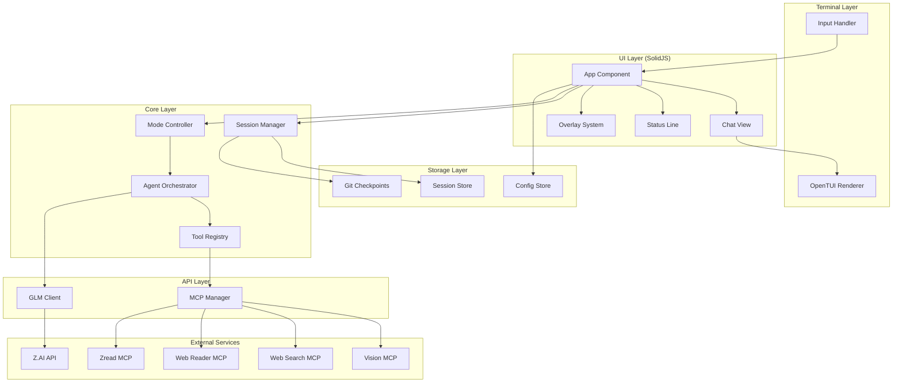
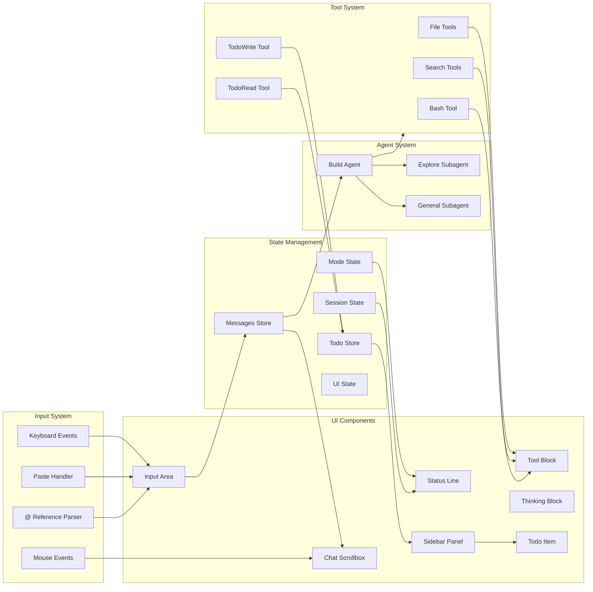

# Design

> Architecture and system design for glm-cli

Generated: 01-19-2026
Updated: 01-20-2026 (Visual Design System from OpenTUI + frontend-design skills)

---

## 1. System Overview

glm-cli is a terminal-based AI coding agent with a brutalist, flicker-free UI. It connects to Zhipu AI's GLM models via the Coding Plan API and integrates with 4 MCP servers for extended capabilities.

### Design Goals

1. **Flicker-Free** - 16ms event batching, 60fps streaming
2. **Brutalist** - No emojis, minimal decoration, function over form
3. **Responsive** - Sub-50ms input latency
4. **Resilient** - Auto-retry, auto-save, graceful degradation

---

## 2. System Architecture



---

## 3. Component Architecture



---

## 4. Visual Design System

### 4.1 Design Philosophy: Brutally Minimal

1. **Function over decoration** - Every element serves a purpose
2. **Raw and honest** - No unnecessary embellishment
3. **Dense and information-forward** - Maximize useful content
4. **High contrast** - Clear visual hierarchy
5. **Monospace precision** - Embrace the grid
6. **No emojis** - ASCII indicators only

### 4.2 Color Palette

**Mode Colors:**
| Mode | Color | Hex | Usage |
|------|-------|-----|-------|
| AUTO | White | `#ffffff` | Default mode indicator |
| AGENT | Cyan | `#5cffff` | Primary accent, active state |
| PLANNER | Purple | `#b48eff` | Planning mode indicator |
| PLAN-PRD | Blue | `#5c8fff` | PRD mode indicator |
| DEBUG | Orange | `#ffaa5c` | Debug mode indicator |

**Status Colors:**
| Status | Color | Hex | Usage |
|--------|-------|-----|-------|
| Success | Green | `#6fca6f` | [OK], additions, connected |
| Warning | Yellow | `#e6c655` | Caution states |
| Error | Red | `#ff6b6b` | [FAIL], deletions, errors |
| Info | Blue | `#5c8fff` | Informational messages |

**UI Colors:**
| Purpose | Color | Hex |
|---------|-------|-----|
| Primary accent | Cyan | `#5cffff` |
| Secondary/Dim | Gray | `#666666` |
| Primary text | White | `#ffffff` |
| Background | Terminal default | - |

**Logo Gradient (left to right):**
```
#5cffff → #4ad4d4 → #38a9a9 → #267e7e → #1a6666
(Bright)                                    (Dim)
```

### 4.3 Typography

**Hierarchy through weight, not size:**
- **Bold** - Headings, labels, role names
- Normal - Primary content
- *Italic* - Thinking/reasoning content
- Dim - Secondary info, timestamps, muted states

**Text Treatments:**
```
UPPERCASE         Section headers (rare)
Normal case       Primary content
lowercase         Commands, paths, technical
dim/muted         Secondary info, timestamps
italic            AI thinking, metadata
```

### 4.4 ASCII Indicators

**Status Indicators:**
```
▶  Collapsed/play
▼  Expanded
●  Status dot (rare)
```

**Todo Status:**
```
[ ]  Pending (dim)
[>]  In progress (cyan)
[x]  Completed (dim)
[-]  Cancelled (dim)
```

**Tool Results:**
```
[OK]    Success (green)
[FAIL]  Failure (red)
```

**Progress Bar:**
```
[████████░░] 80%
█  Filled block
░  Empty block
```

**Separators:**
```
│  Vertical pipe (status line segments)
───  Light horizontal rule (underlines)
════  Heavy horizontal rule (section dividers)
```

### 4.5 Borders and Boxes

**Box Characters:**
```
┌──────────────────────┐
│  Single line box     │
└──────────────────────┘

╭──────────────────────╮
│  Rounded box         │  (NOT used in main UI)
╰──────────────────────╯
```

**Usage Rules:**
- Single line (`┌─┐`) for primary containers
- Horizontal rules (`───`) for section dividers
- No rounded corners in main UI (too soft for brutalist)
- Minimal nested boxes

### 4.6 Spacing

**Grid:** 1 character = 1 unit

**Padding:**
- Minimal internal padding (1-2 chars)
- Consistent margins between sections

**Density:**
- Prefer dense layouts over spread out
- Use whitespace strategically, not liberally

---

## 5. Layout Specifications

### 5.1 Welcome Screen

```
┌────────────────────────────────────────────────────────────────────────────────────────────────────────────┐
│                                                                                                            │
│     ██████╗ ██╗     ███╗   ███╗       ██████╗██╗     ██╗                                                   │
│    ██╔════╝ ██║     ████╗ ████║      ██╔════╝██║     ██║                                                   │
│    ██║  ███╗██║     ██╔████╔██║█████╗██║     ██║     ██║                                                   │
│    ██║   ██║██║     ██║╚██╔╝██║╚════╝██║     ██║     ██║                                                   │
│    ╚██████╔╝███████╗██║ ╚═╝ ██║      ╚██████╗███████╗██║                                                   │
│     ╚═════╝ ╚══════╝╚═╝     ╚═╝       ╚═════╝╚══════╝╚═╝                                                   │
│                                                                                                            │
│    v0.1.0                                                              built 01-20-2026                    │
│    Model: GLM-4.7                                                      Dir: ~/glm-cli                      │
│                                                                                                            │
└────────────────────────────────────────────────────────────────────────────────────────────────────────────┘

┌─ AUTO (Thinking) ──────────────────────────────────────────────────────────────────────────────────────────┐
│                                                                                                            │
│  > _                                                                                                       │
│                                                                                                            │
│    What are we building, breaking, or making better?                                                       │
│                                                                                                            │
└────────────────────────────────────────────────────────────────────────────────────────────────────────────┘
GLM-4.7 │ AUTO │ [░░░░░░░░░░] 0% │ ~/glm-cli │  main │ MCPs: 4/4 │ 01-20-2026
```

**Elements:**
- ASCII logo with cyan-to-dim gradient
- Version and build date (left/right aligned)
- Model and working directory info
- Input box with mode in title
- Ghost text placeholder
- Status line at bottom

### 5.2 Main Session View

```
┌─────────────────────────────────────────────────────────────────┬──────────────────────────────────────────┐
│                                                                 │ Session                                  │
│  You                                              12:34 PM      │ ───────────────────────────────────────  │
│  ───                                                            │ Context: 42% (84k/200k)                  │
│  Can you help me implement the API client?                      │ Cost: $0.12                              │
│                                                                 │                                          │
│  GLM-4.7                                          12:34 PM      │ ▼ Todo                                   │
│  ────────                                                       │ [ ] Set up project structure             │
│  I'll help you implement the API client. Let me start by        │ [>] Implement API client                 │
│  creating the types and then the client class.                  │ [ ] Add error handling                   │
│                                                                 │ [x] Write configuration                  │
│  ▶ file_write src/api/types.ts                          [OK]    │                                          │
│  ▶ file_write src/api/client.ts                         [OK]    │ ▶ MCPs 4/4                               │
│                                                                 │                                          │
│  The API client is now ready. It includes:                      │ ▶ Modified Files                         │
│  - Type definitions for all 8 GLM models                        │                                          │
│  - Retry logic with exponential backoff                         │                                          │
│                                                                 │                                          │
├─────────────────────────────────────────────────────────────────┤                                          │
│ ┌─ AGENT (Thinking) ────────────────────────────────────────┐   │                                          │
│ │                                                           │   │                                          │
│ │  > _                                                      │   │                                          │
│ │                                                           │   │                                          │
│ │    What are we building, breaking, or making better?      │   │                                          │
│ │                                                           │   │                                          │
│ └───────────────────────────────────────────────────────────┘   │                                          │
├─────────────────────────────────────────────────────────────────┴──────────────────────────────────────────┤
│ GLM-4.7 │ AGENT │ [██████░░░░] 62% │ ~/glm-cli │  main │ MCPs: 4/4 │ 01-20-2026                           │
└────────────────────────────────────────────────────────────────────────────────────────────────────────────┘
```

**Layout Structure:**
- Chat area (left, flexible width)
- Sidebar (right, fixed 42 chars)
- Input area (below chat)
- Status line (bottom, full width)

### 5.3 Status Line

**Format:**
```
MODEL │ MODE │ [PROGRESS] XX% │ DIR │  BRANCH │ MCPs: X/X │ DATE
```

**Example:**
```
GLM-4.7 │ AGENT │ [██████░░░░] 62% │ ~/glm-cli │  main │ MCPs: 4/4 │ 01-20-2026
```

**During tool execution:**
```
GLM-4.7 │ AGENT │ [████░░░░░░] 42% │ ~/glm-cli │  main │ MCPs: 4/4 │ file_write...
```

**Segments:**
| Segment | Content | Color |
|---------|---------|-------|
| Model | Model name | White |
| Mode | Mode name | Mode color |
| Progress | Context % bar | White/dim |
| Dir | Working directory | Dim |
| Branch | Git branch | Dim |
| MCPs | Connection status | Green if all connected |
| Date/Activity | Current date or tool | Dim |

### 5.4 Message Block

**User Message:**
```
You                                              12:34 PM
───
Can you help me implement the API client?
```

**Assistant Message:**
```
GLM-4.7                                          12:34 PM
────────
I'll help you implement the API client. Let me start by
creating the types and then the client class.

▶ file_write src/api/types.ts                        [OK]
▶ file_write src/api/client.ts                       [OK]

The API client is now ready.
```

**Styling:**
- Role name: Bold, left-aligned
- Timestamp: Dim, right-aligned
- Underline: Short for user (`───`), longer for assistant (`────────`)
- Content: Normal text
- Tool blocks: Inline with message

### 5.5 Tool Block

**Collapsed:**
```
▶ file_read src/api/client.ts                                                     [OK]
```

**Expanded:**
```
▼ file_read src/api/client.ts                                                     [OK]
  ┌────────────────────────────────────────────────────────────────────────────────────┐
  │  1  import { OpenAI } from "openai"                                                │
  │  2                                                                                 │
  │  3  export class GLMClient {                                                       │
  │  4    private client: OpenAI                                                       │
  │  ...                                                                               │
  └────────────────────────────────────────────────────────────────────────────────────┘
```

**With Diff:**
```
▼ file_edit src/api/client.ts                                                     [OK]
  ┌────────────────────────────────────────────────────────────────────────────────────┐
  │  + import { z } from "zod"                                                         │
  │    import { OpenAI } from "openai"                                                 │
  │  -                                                                                 │
  │  + const ConfigSchema = z.object({                                                 │
  │  +   apiKey: z.string(),                                                           │
  │  + })                                                                              │
  └────────────────────────────────────────────────────────────────────────────────────┘
```

**Styling:**
- Indicator: `▶` collapsed, `▼` expanded (dim)
- Tool name: Normal
- Path: Dim
- Status: `[OK]` green, `[FAIL]` red
- Content box: Single-line border, indented
- Diff: `+` green, `-` red, context white

### 5.6 Thinking Block

**During Streaming:**
```
│ Thinking: I need to analyze the current API structure and determine the best
│ approach for implementing retry logic. The exponential backoff pattern works
│ well for transient failures...█
```

**Collapsed (after completion):**
```
▶ Thinking                                                                  [collapsed]
```

**Expanded:**
```
▼ Thinking
  │ I need to analyze the current API structure and determine the best approach
  │ for implementing retry logic. The exponential backoff pattern works well for
  │ transient failures. I'll use a base delay of 1000ms with a multiplier of 2,
  │ capped at 5 retries maximum.
```

**Styling:**
- Left border indicator during streaming
- Italic text
- Dim color
- Blinking cursor during streaming
- Auto-collapse after generation completes

### 5.7 Sidebar

**Structure:**
```
Session
───────────────────────────────────────
Context: 42% (84k/200k)
Cost: $0.12

▼ Todo
[ ] Set up project structure
[>] Implement API client
[ ] Add error handling
[x] Write configuration

▶ MCPs 4/4

▶ Modified Files
```

**Specifications:**
- Fixed width: 42 characters
- Left border separator from main content
- Collapsible sections with `▶`/`▼`
- Section headers: Bold
- Todo items: Status indicators with content
- MCP count: Green if all connected

### 5.8 Input Area

**Empty with ghost text:**
```
┌─ AGENT (Thinking) ──────────────────────────────────────────────────────────────────┐
│                                                                                     │
│  > _                                                                                │
│                                                                                     │
│    What are we building, breaking, or making better?                                │
│                                                                                     │
└─────────────────────────────────────────────────────────────────────────────────────┘
```

**With content:**
```
┌─ AGENT (Thinking) ──────────────────────────────────────────────────────────────────┐
│                                                                                     │
│  > Can you help me implement a streaming handler?                                   │
│    I need it to:                                                                    │
│    - Parse SSE chunks                                                               │
│    - Extract thinking content_                                                      │
│                                                                                     │
└─────────────────────────────────────────────────────────────────────────────────────┘
```

**With autocomplete:**
```
┌─ AGENT (Thinking) ──────────────────────────────────────────────────────────────────┐
│                                                                                     │
│  > Review @src/api/cl_                                                              │
│    ┌────────────────────────────────────────┐                                       │
│    │ > src/api/client.ts                    │                                       │
│    │   src/api/client.test.ts               │                                       │
│    └────────────────────────────────────────┘                                       │
│                                                                                     │
└─────────────────────────────────────────────────────────────────────────────────────┘
```

**Specifications:**
- Box with mode in title
- "(Thinking)" shown when thinking mode enabled
- Prompt cursor: `>`
- Ghost text: Dim, below prompt
- Multi-line support via Shift+Enter
- Autocomplete dropdown positioned at cursor

### 5.9 Command Palette

```
                    ┌─ Commands ─────────────────────────────────── [Esc] ──┐
                    │                                                       │
                    │  > /new                                               │
                    │    /new         New session                           │
                    │    /save        Save session                          │
                    │    /load        Load session                          │
                    │    /undo        Revert last change                    │
                    │    /redo        Restore undone                        │
                    │    /model       Switch model                          │
                    │    /mode        Switch mode                           │
                    │    /think       Toggle thinking                       │
                    │    /stats       Session stats                         │
                    │    /help        Show help                             │
                    │    /quit        Exit                                  │
                    │                                                       │
                    └───────────────────────────────────────────────────────┘
```

### 5.10 Session End Summary

```
────────────────────────────────────────────────────────────────────────────────────────
  GLM-CLI SESSION COMPLETE
────────────────────────────────────────────────────────────────────────────────────────

  Duration        1h 23m 45s
  Modes           AGENT (primary) → PLANNER (1 switch)
  
────────────────────────────────────────────────────────────────────────────────────────
  TOOLS
────────────────────────────────────────────────────────────────────────────────────────

  Calls           15 total        12 success      3 failed
  Code            +142 lines      -38 lines

────────────────────────────────────────────────────────────────────────────────────────

  Until next time!

────────────────────────────────────────────────────────────────────────────────────────
```

---

## 6. Directory Structure

```
glm-cli/
├── src/
│   ├── index.tsx                # CLI entry point
│   ├── global.ts                # Global paths configuration
│   │
│   ├── bus/
│   │   ├── index.ts             # Re-exports
│   │   ├── bus.ts               # Event bus singleton
│   │   └── events.ts            # Event definitions
│   │
│   ├── storage/
│   │   ├── index.ts             # Re-exports
│   │   └── storage.ts           # File-based storage
│   │
│   ├── agent/
│   │   ├── build.ts             # Primary build agent
│   │   ├── explore.ts           # Explore subagent (read-only)
│   │   ├── general.ts           # General subagent
│   │   └── orchestrator.ts      # Agent coordination
│   │
│   ├── api/
│   │   ├── client.ts            # GLM API client
│   │   ├── stream.ts            # Streaming handler
│   │   └── types.ts             # API types
│   │
│   ├── mcp/
│   │   ├── manager.ts           # MCP connection manager
│   │   ├── vision.ts            # Vision MCP (stdio)
│   │   ├── web-search.ts        # Web Search MCP (HTTP)
│   │   ├── web-reader.ts        # Web Reader MCP (HTTP)
│   │   └── zread.ts             # Zread MCP (HTTP)
│   │
│   ├── session/
│   │   ├── manager.ts           # Session lifecycle
│   │   ├── checkpoint.ts        # Git checkpoints
│   │   ├── compact.ts           # Auto-compaction
│   │   ├── store.ts             # Session persistence
│   │   └── todo.ts              # Todo data model and operations
│   │
│   ├── tools/
│   │   ├── registry.ts          # Tool registration
│   │   ├── file-read.ts         # File read tool
│   │   ├── file-write.ts        # File write tool
│   │   ├── file-edit.ts         # File edit tool
│   │   ├── glob.ts              # Glob tool
│   │   ├── grep.ts              # Grep tool
│   │   ├── bash.ts              # Bash tool
│   │   ├── todo-write.ts        # TodoWrite tool
│   │   └── todo-read.ts         # TodoRead tool
│   │
│   ├── ui/
│   │   ├── App.tsx              # Root component
│   │   ├── design.ts            # Design constants (colors, indicators)
│   │   ├── components/
│   │   │   ├── WelcomeScreen.tsx  # Welcome/startup screen
│   │   │   ├── ChatView.tsx       # Message list
│   │   │   ├── InputArea.tsx      # User input
│   │   │   ├── StatusLine.tsx     # Bottom status
│   │   │   ├── Sidebar.tsx        # Right sidebar panel
│   │   │   ├── TodoItem.tsx       # Individual todo display
│   │   │   ├── ToolBlock.tsx      # Collapsible tool result
│   │   │   ├── ThinkingBlock.tsx  # Collapsible thinking
│   │   │   ├── MessageBlock.tsx   # Single message
│   │   │   ├── Autocomplete.tsx   # @ reference dropdown
│   │   │   ├── Overlay.tsx        # Modal overlays
│   │   │   └── ProgressBar.tsx    # Context usage bar
│   │   │
│   │   └── context/
│   │       ├── session.tsx      # Session context
│   │       ├── mode.tsx         # Mode context
│   │       ├── todo.tsx         # Todo state context
│   │       └── ui.tsx           # UI state context
│   │
│   ├── input/
│   │   ├── handler.ts           # Input event handler
│   │   ├── paste.ts             # Multi-line paste detection
│   │   ├── at-refs.ts           # @ file reference parser
│   │   └── shortcuts.ts         # Keyboard shortcuts
│   │
│   ├── commands/
│   │   ├── registry.ts          # Command registration
│   │   ├── new.ts               # /new command
│   │   ├── save.ts              # /save command
│   │   ├── load.ts              # /load command
│   │   ├── compact.ts           # /compact command
│   │   ├── undo.ts              # /undo command
│   │   ├── redo.ts              # /redo command
│   │   ├── model.ts             # /model command
│   │   ├── mode.ts              # /mode command
│   │   ├── think.ts             # /think command
│   │   ├── instruct.ts          # /instruct command
│   │   ├── config.ts            # /config command
│   │   ├── stats.ts             # /stats command
│   │   ├── help.ts              # /help command
│   │   └── quit.ts              # /quit, /exit commands
│   │
│   ├── modes/
│   │   ├── auto.ts              # AUTO mode logic
│   │   ├── agent.ts             # AGENT mode logic
│   │   ├── planner.ts           # PLANNER mode logic
│   │   ├── plan-prd.ts          # PLAN-PRD mode logic
│   │   └── debug.ts             # DEBUG mode logic
│   │
│   └── util/
│       ├── config.ts            # Configuration loader
│       ├── instructions.ts      # Instruction file discovery
│       ├── git.ts               # Git utilities
│       ├── batch.ts             # 16ms event batching
│       ├── lock.ts              # File locking utility
│       └── logger.ts            # Logging utility
│
├── .opencode/skills/            # AI assistance skills
├── docs/                        # Project documentation
├── AGENTS.md                    # Project brain
├── PRINCIPLES.md                # Non-negotiable rules
├── README.md                    # Project overview
├── package.json
├── tsconfig.json
└── bunfig.toml
```

---

## 7. Data Flow

### 7.1 User Input Flow

1. Keyboard event captured by OpenTUI
2. Input handler processes event
3. If `/command`, route to command registry
4. If `@reference`, trigger autocomplete
5. On Enter, add message to Messages store
6. Mode controller selects appropriate agent
7. Agent processes with tools
8. Streaming response batched at 16ms
9. UI re-renders via SolidJS reconciliation

### 7.2 Streaming Response Flow

1. GLM API returns SSE stream
2. Stream handler parses chunks
3. Thinking content extracted to separate buffer
4. Text content buffered for 16ms
5. `batch()` coalesces state updates
6. `reconcile()` applies minimal DOM changes
7. Scrollbox auto-scrolls to bottom

### 7.3 Tool Execution Flow

1. Agent requests tool execution
2. Tool registry validates parameters (Zod)
3. Tool executes with timeout
4. Result returned to agent
5. ToolBlock component renders result
6. Block starts collapsed, expandable

### 7.4 Session Checkpoint Flow

1. Assistant message completes
2. File changes detected
3. Git stash created with message ID
4. Checkpoint reference stored in session
5. /undo pops stash, /redo re-applies

### 7.5 Todo Update Flow

1. Agent calls TodoWrite tool with updated todo list
2. Tool validates todos via Zod schema
3. Todo.update() writes to storage: `["todo", sessionID]`
4. Bus publishes `todo.updated` event
5. UI context receives event, updates TodoState store
6. Sidebar re-renders with new todos via SolidJS reconciliation
7. Tool returns count of non-completed todos

---

## 8. Key Design Decisions

### 8.1 OpenTUI + SolidJS

**Why:** Flicker-free rendering is non-negotiable. OpenTUI's Zig-powered renderer with SolidJS fine-grained reactivity eliminates the re-render storms common with React-based TUI solutions.

**Trade-off:** Smaller ecosystem than Ink, but performance gains are substantial.

**Configuration Required:**
```json
// tsconfig.json
{
  "compilerOptions": {
    "jsx": "preserve",
    "jsxImportSource": "@opentui/solid"
  }
}
```

```toml
# bunfig.toml
preload = ["@opentui/solid/preload"]
```

### 8.2 Single API Endpoint

**Why:** The Coding Plan endpoint (`https://api.z.ai/api/coding/paas/v4/`) enables thinking mode by default. Falling back to standard endpoints would lose this capability.

**Trade-off:** No graceful API fallback, but explicit failure is better than silent degradation.

### 8.3 Git-Based Undo/Redo

**Why:** Git stash provides atomic, reliable file state snapshots. Per-message checkpoints enable granular undo.

**Trade-off:** Requires git repository, but most coding projects already have this.

### 8.4 Agent-Controlled Delegation

**Why:** Simpler UX than exposing @ syntax for subagents. The primary agent decides when to delegate based on task complexity.

**Trade-off:** Less user control, but more coherent agent behavior.

### 8.5 16ms Event Batching

**Why:** 60fps target requires updates no faster than 16ms. Batching prevents render thrashing during high-frequency streaming.

**Trade-off:** Slight latency increase (imperceptible), major stability gain.

### 8.6 Design Constants File

**Why:** Single source of truth for colors, indicators, and spacing values. Prevents inconsistency across components.

**Location:** `src/ui/design.ts`

---

## 9. State Management

### 9.1 Global State (SolidJS Stores)

```typescript
// Session store
interface SessionState {
  id: string
  messages: Message[]
  mode: Mode
  model: Model
  thinking: boolean
  stats: SessionStats
}

// Todo store (per session)
interface Todo {
  id: string        // Unique identifier (e.g., "1", "2", "task-abc")
  content: string   // Brief description of the task
  status: "pending" | "in_progress" | "completed" | "cancelled"
  priority: "high" | "medium" | "low"
}

interface TodoState {
  [sessionID: string]: Todo[]
}

// UI store
interface UIState {
  overlay: Overlay | null
  inputValue: string
  selectedTool: number | null
  scrollPosition: number
  sidebarExpanded: {
    todo: boolean
    mcp: boolean
    diff: boolean
  }
}
```

### 9.2 Context Providers

- `SessionProvider` - Session lifecycle, auto-save
- `ModeProvider` - Mode switching, mode-specific tools
- `TodoProvider` - Todo state, event subscription
- `UIProvider` - Overlay state, input focus

### 9.3 Event Bus

```typescript
// Todo events
namespace TodoEvents {
  const Updated = BusEvent.define("todo.updated", z.object({
    sessionID: z.string(),
    todos: z.array(TodoSchema),
  }))
}

// Event flow: Tool -> Storage -> Bus -> UI
```

---

## 10. Todo System Design

### 10.1 Data Model

```typescript
// src/session/todo.ts
const TodoSchema = z.object({
  id: z.string().describe("Unique identifier for the todo item"),
  content: z.string().describe("Brief description of the task"),
  status: z.enum(["pending", "in_progress", "completed", "cancelled"])
    .describe("Current status of the task"),
  priority: z.enum(["high", "medium", "low"])
    .describe("Priority level of the task"),
})

type Todo = z.infer<typeof TodoSchema>
```

### 10.2 Storage

Todos are stored per-session in the storage layer:
- Key: `["todo", sessionID]`
- Format: JSON array of Todo objects
- Location: `~/.config/glm-cli/storage/todo/{sessionID}.json`

### 10.3 Tools

**TodoWrite** - Replaces the entire todo list
- Parameters: `{ todos: Todo[] }`
- Returns: Count of non-completed todos
- Behavior: Full replacement (not incremental)

**TodoRead** - Returns current todo list
- Parameters: None
- Returns: Current todos array
- Use: Agent checks status before/after tasks

### 10.4 UI Display (Sidebar)

```
▼ Todo
[ ] Set up project structure
[>] Implement API client        <- in_progress (cyan)
[ ] Add error handling
[x] Write configuration loader  <- completed (dim)
```

**Brutalist Design Rules:**
- No emojis - use ASCII: `[ ]`, `[>]`, `[x]`, `[-]`
- Status colors: pending=dim, in_progress=cyan, completed=dim
- Collapsible when >2 items
- Hidden when all completed
- Click to expand/collapse section

### 10.5 Agent Guidelines

The agent should use TodoWrite proactively when:
1. Task requires 3+ distinct steps
2. User provides a list of tasks
3. Complex, non-trivial work

The agent should NOT use todos when:
1. Single trivial task
2. Purely informational request
3. Task completes in <3 steps

**State Management Rules:**
- Only ONE todo `in_progress` at a time
- Mark complete IMMEDIATELY after finishing
- Cancel irrelevant tasks rather than leaving pending

---

## 11. Error Handling Strategy

| Error Type | Handling |
|------------|----------|
| API timeout | 5 retries with exponential backoff |
| API auth failure | Prompt for new API key |
| MCP connection failure | Disable affected tools, notify user |
| Tool execution error | Display error in tool block, continue |
| Git operation failure | Warn user, disable undo/redo |
| Parse error | Log details, show user-friendly message |
| Todo storage failure | Log error, continue without persistence |

---

## 12. Security Considerations

1. **API Key** - Stored in environment variable or `~/.config/glm-cli/config.json`
2. **File Access** - Tools operate within working directory by default
3. **Command Execution** - Bash tool shows command before execution
4. **No Logging of Secrets** - API keys redacted from all logs
5. **Git Safety** - No force push, no remote operations without confirmation

---

## 13. OpenTUI Implementation Patterns

### 13.1 Component Naming (Solid)

Multi-word components use underscores:
```tsx
<tab_select />    // Not <tab-select>
<ascii_font />    // Not <ascii-font>
<line_number />   // Not <line-number>
```

### 13.2 Text Styling

Use nested modifier tags, not props:
```tsx
// CORRECT
<text>
  <span fg="#5cffff"><strong>AGENT</strong></span>
  <span fg="#666666"> │ </span>
  <span fg="#ffffff">GLM-4.7</span>
</text>

// WRONG
<text bold fg="#5cffff">AGENT</text>
```

### 13.3 Input Handling

```tsx
<input
  value={value()}           // Signal accessor with ()
  onInput={setValue}        // Use onInput, not onChange
  placeholder="..."
  focused                   // Required for keyboard input
/>
```

### 13.4 Select Events

| Event | Trigger | Use |
|-------|---------|-----|
| `onSelect` | Enter pressed | Confirm selection |
| `onChange` | Arrow keys | Preview/navigate |

### 13.5 Exit Handling

```tsx
// NEVER use process.exit() directly
// ALWAYS use renderer.destroy()

const renderer = useRenderer()

const handleExit = () => {
  renderer.destroy()  // Cleans up and exits properly
}
```

### 13.6 ScrollBox Requirements

```tsx
<scrollbox
  height={someHeight}      // REQUIRED - must have explicit height
  focused                  // For keyboard scrolling
>
  <For each={items()}>
    {(item) => <text>{item}</text>}
  </For>
</scrollbox>
```

---

## 14. Related Specifications

For detailed implementation specifications, see:

| Specification | Purpose |
|---------------|---------|
| [specs/storage.md](specs/storage.md) | Storage module API, file structure, locking |
| [specs/event-bus.md](specs/event-bus.md) | Event bus implementation, event definitions |
| [specs/tool-descriptions.md](specs/tool-descriptions.md) | Full prompt text for all tools |
