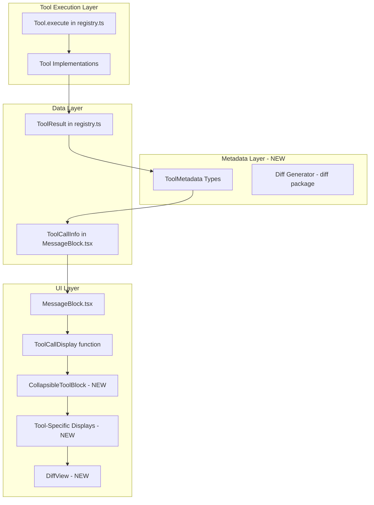
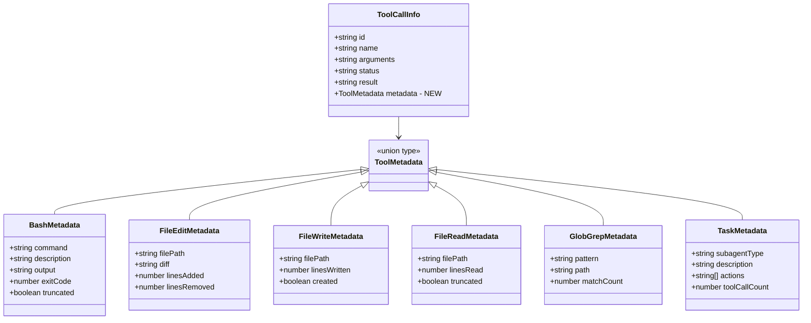

# Tool Display Refactor - Design

> Architecture and component design for enhanced tool call display

Generated: 01-22-2026
Status: Planned Enhancement (Outside Original MVP Scope)
Baseline Version: v0.10.2

---

## Architecture Overview

The Tool Display Refactor adds a metadata layer to tool execution and a component system for rendering tool-specific displays. It follows the existing glm-cli patterns for state management (signals), event handling (event bus), and UI (OpenTUI + SolidJS).

### System Architecture Diagram



### Component Hierarchy Diagram



---

## Type Definitions

### Location: `src/types/tool-metadata.ts` (NEW FILE)

```typescript
/**
 * Tool Metadata Types
 * Structured data returned by tools for enhanced UI display
 */

// Bash tool metadata
export interface BashMetadata {
  type: "bash";
  command: string;           // The command executed
  description?: string;      // Description from tool args
  output: string;            // stdout + stderr combined
  exitCode: number;          // Process exit code
  truncated: boolean;        // True if output was cut
  workdir?: string;          // Working directory if specified
}

// File write metadata
export interface FileWriteMetadata {
  type: "file_write";
  filePath: string;          // Path to file
  linesWritten: number;      // Number of lines in content
  created: boolean;          // True if file didn't exist before
}

// File edit metadata
export interface FileEditMetadata {
  type: "file_edit";
  filePath: string;          // Path to file
  diff: string;              // Unified diff format
  linesAdded: number;        // Lines with + prefix
  linesRemoved: number;      // Lines with - prefix
}

// File read metadata
export interface FileReadMetadata {
  type: "file_read";
  filePath: string;          // Path to file
  linesRead: number;         // Lines returned
  truncated: boolean;        // True if content was cut
}

// Glob metadata
export interface GlobMetadata {
  type: "glob";
  pattern: string;           // Search pattern
  path?: string;             // Search path if specified
  matchCount: number;        // Number of matches found
}

// Grep metadata
export interface GrepMetadata {
  type: "grep";
  pattern: string;           // Search pattern
  path?: string;             // Search path if specified
  matchCount: number;        // Number of matches found
}

// Task (subagent) metadata
export interface TaskMetadata {
  type: "task";
  subagentType: string;      // "explore" | "general"
  description: string;       // Task description
  actions: string[];         // Summary of actions taken
  toolCallCount: number;     // Total tool calls made
}

// Union type for all metadata
export type ToolMetadata = 
  | BashMetadata 
  | FileWriteMetadata 
  | FileEditMetadata 
  | FileReadMetadata 
  | GlobMetadata 
  | GrepMetadata 
  | TaskMetadata;

// Type guard functions
export function isBashMetadata(m: ToolMetadata): m is BashMetadata {
  return m.type === "bash";
}

export function isFileEditMetadata(m: ToolMetadata): m is FileEditMetadata {
  return m.type === "file_edit";
}

export function isFileWriteMetadata(m: ToolMetadata): m is FileWriteMetadata {
  return m.type === "file_write";
}

export function isFileReadMetadata(m: ToolMetadata): m is FileReadMetadata {
  return m.type === "file_read";
}

export function isGlobMetadata(m: ToolMetadata): m is GlobMetadata {
  return m.type === "glob";
}

export function isGrepMetadata(m: ToolMetadata): m is GrepMetadata {
  return m.type === "grep";
}

export function isTaskMetadata(m: ToolMetadata): m is TaskMetadata {
  return m.type === "task";
}
```

---

## Component Specifications

### 1. CollapsibleToolBlock Component

**File:** `src/ui/components/CollapsibleToolBlock.tsx` (NEW)

**Props:**
```typescript
interface CollapsibleToolBlockProps {
  status: "pending" | "running" | "success" | "error";
  children: JSX.Element;              // Title content
  expandedContent?: JSX.Element;      // Content shown when expanded
  defaultExpanded?: boolean;          // Default: false, true for errors
}
```

**Behavior:**
- Shows `▶` when collapsed, `▼` when expanded
- Shows status indicator: `✓` (dim), `✗` (red), `~` (dim), `·` (dim)
- Click anywhere on line toggles expand/collapse
- Errors auto-expand by default

### 2. DiffView Component

**File:** `src/ui/components/DiffView.tsx` (NEW)

**Props:**
```typescript
interface DiffViewProps {
  diff: string;           // Unified diff string
  maxLines?: number;      // Max lines to show (default: 30)
}
```

**Behavior:**
- Parses unified diff format
- Colors `+` lines green (`Colors.diff.addition`)
- Colors `-` lines red (`Colors.diff.deletion`)
- Colors `@@` headers dim
- Truncates with "... (N more changes)"

### 3. Updated ToolCallDisplay

**File:** `src/ui/components/MessageBlock.tsx` (MODIFY)

Routes to tool-specific displays based on metadata type.

---

## Key Design Decisions

### Decision 1: Metadata Location
**Decision:** Store metadata in `ToolCallInfo.metadata`
**Rationale:** Keeps data together, simpler state management

### Decision 2: Diff Generation Timing
**Decision:** Generate during tool execution
**Rationale:** File content available at edit time

### Decision 3: Diff Library
**Decision:** Use `diff` npm package
**Rationale:** Proven, has `createPatch` for unified diff

### Decision 4: Collapse State
**Decision:** Local signal per component
**Rationale:** Simple, doesn't need persistence

### Decision 5: Output Limits
**Decision:** 50 lines max for bash, 30 changed lines for diff
**Rationale:** Prevents UI crashes, keeps view manageable

---

## File Changes Summary

| File | Change Type | Description |
|------|-------------|-------------|
| `package.json` | Modify | Add `diff` and `@types/diff` |
| `src/types/tool-metadata.ts` | **New** | Metadata type definitions |
| `src/ui/design.ts` | Modify | Add status indicators |
| `src/tools/bash.ts` | Modify | Return BashMetadata |
| `src/tools/file-write.ts` | Modify | Return FileWriteMetadata |
| `src/tools/file-edit.ts` | Modify | Generate diff, return FileEditMetadata |
| `src/tools/file-read.ts` | Modify | Return FileReadMetadata |
| `src/tools/glob.ts` | Modify | Return GlobMetadata |
| `src/tools/grep.ts` | Modify | Return GrepMetadata |
| `src/ui/components/CollapsibleToolBlock.tsx` | **New** | Collapsible container |
| `src/ui/components/DiffView.tsx` | **New** | Diff renderer |
| `src/ui/components/MessageBlock.tsx` | Modify | Updated ToolCallDisplay |

---

## Visual Mockups

### Collapsed State (Success)
```
▶ ✓ bash "install dependencies"
▶ ✓ file_write src/api/client.ts (142 lines)
▶ ✓ file_edit src/ui/App.tsx (+12/-5)
▶ ✓ glob "**/*.ts" (47 matches)
```

### Collapsed State (Error)
```
▼ ✗ bash "npm test" (exit 1)
    $ npm test
    FAIL src/App.test.ts
    Expected: true
    Received: false
```

### Expanded Bash
```
▼ ✓ bash "install dependencies"
    $ npm install zod openai
    added 42 packages in 2.3s
    
    ✓ All packages installed
    ... (15 more lines)
```

### Expanded File Edit with Diff
```
▼ ✓ file_edit src/ui/App.tsx (+12/-5)
    @@ -45,7 +45,12 @@
     const [mode, setMode] = useState("AUTO");
    -const [loading, setLoading] = useState(false);
    +const [loading, setLoading] = useState(false);
    +const [error, setError] = useState<string | null>(null);
```

---

## Related Documents

| Document | Purpose |
|----------|---------|
| [Requirements.md](Requirements.md) | Functional and non-functional requirements |
| [Tasks.md](Tasks.md) | Implementation tasks (BMAD-method) |
